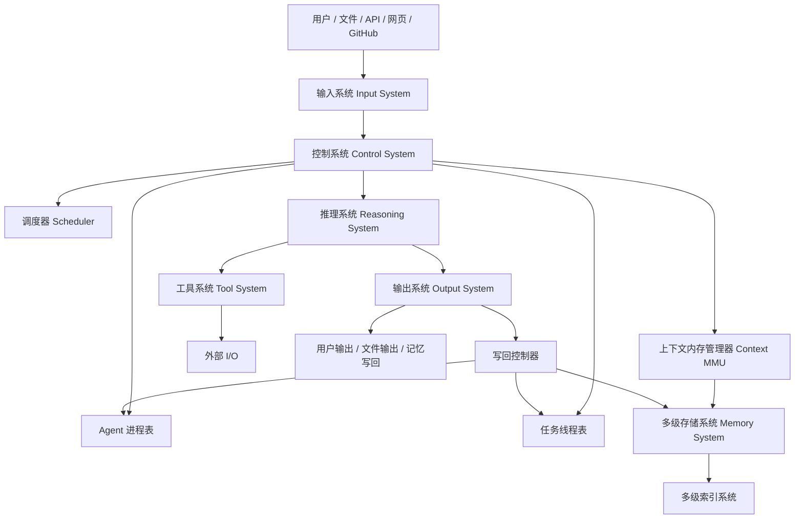
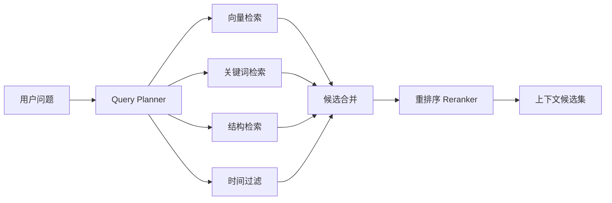
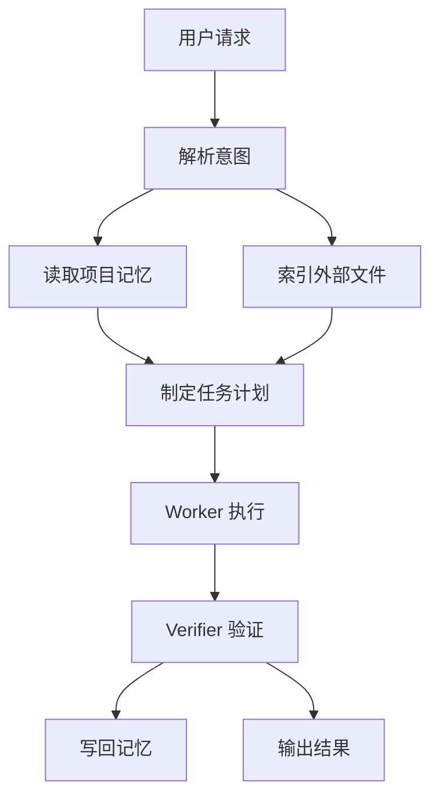
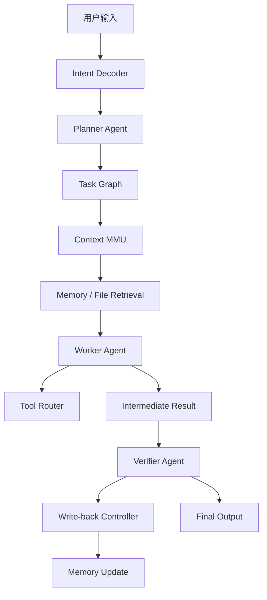

# 面向多 Agent 的类冯诺依曼 Agent-OS 初步计划文档

## 0. 文档定位

本文档用于规划一个面向多智能体系统的运行时架构。该系统参考冯诺依曼体系、操作系统、缓存层次结构和 RAG 检索增强思想，将多 Agent 调用过程抽象为：

- Agent 作为进程；
- Agent 内部任务作为线程；
- LLM 推理模块作为运算器；
- 多级上下文存储系统作为存储器；
- Controller / Scheduler / Context MMU 作为控制器；
- 文件、API、网页、代码仓库、数据库作为输入输出设备；
- 多级索引系统作为地址映射、页表和文件系统索引；
- 工具系统作为 I/O 控制器；
- Agent 消息系统作为系统总线。

该系统的目标不是简单复刻计算机硬件，而是借鉴计算机体系结构与操作系统的核心思想，构建一个可扩展、可追踪、可调度、可记忆、可验证的 Agent Runtime。

---

# 1. 核心目标

## 1.1 总体目标

构建一个支持多 Agent 协同执行复杂任务的运行时系统，使其能够在有限上下文窗口下高效调用：

1. 当前对话上下文；
2. 当前任务状态；
3. 历史长期记忆；
4. 外部大文件；
5. 代码仓库；
6. 工具执行结果；
7. 多 Agent 中间产物。

系统应具备以下能力：

- 分层记忆管理；
- 上下文按需加载；
- 多级索引检索；
- 多 Agent 调度；
- 任务分解与执行；
- 工具调用控制；
- 结果验证；
- 记忆写回；
- 冲突处理；
- 可观测性与审计。

## 1.2 需要解决的核心问题

传统 LLM / RAG / Agent 系统常见问题包括：

1. 上下文窗口有限；
2. 长历史对话容易遗忘；
3. 大文件无法整体进入上下文；
4. 多 Agent 输出难以协调；
5. 检索结果不稳定；
6. Agent 工具调用不可控；
7. 记忆容易污染；
8. 旧记忆与新信息冲突；
9. 系统缺少状态管理；
10. 任务执行过程不可追踪。

本项目要解决的不是单点 RAG，而是构建一个完整的 Agent Runtime 管理层。

---

# 2. 架构类比与需要警惕的漏洞

## 2.1 可行的类比

| 计算机体系结构 | Agent-OS 对应物 |
|---|---|
| 存储器 | 多级上下文存储系统 |
| 运算器 | LLM / 推理模块 |
| 控制器 | Planner / Scheduler / Context Manager |
| 输入设备 | 用户输入、文件、网页、API、数据库 |
| 输出设备 | 回答、报告、代码、文件、工具结果 |
| 程序 | Prompt、Workflow、Task Graph、Agent Policy |
| 数据 | 对话、记忆、文档、代码、检索片段 |
| 进程 | Agent 实例 |
| 线程 | Agent 内部子任务 |
| 总线 | Agent Message Bus / Tool Bus / Memory Bus |
| 页表 | 多级索引系统 |
| 缺页中断 | 上下文中缺少所需信息时触发文件检索 |

## 2.2 不能机械照搬的地方

### 漏洞 1：LLM 不是确定性 CPU

传统 CPU 执行指令是确定性的，而 LLM 推理具有概率性、上下文敏感性和不可完全复现性。

风险：

- 相同输入多次执行可能输出不同结果；
- 中间推理无法像机器指令一样严格验证；
- Agent 状态恢复比进程恢复更困难。

应对策略：

- 将关键任务拆分为结构化步骤；
- 强制输出结构化 JSON / Markdown schema；
- 对关键结果引入 Verifier；
- 对外部事实要求引用来源；
- 对工具调用结果做日志记录；
- 使用 deterministic mode 或低 temperature 执行关键任务。

### 漏洞 2：上下文窗口不是传统内存

上下文窗口是一次推理的输入空间，不支持真正的随机访问，也不能像 RAM 一样持续存在。

风险：

- 历史信息一旦不进入上下文，模型本轮就不可见；
- 上下文装配错误会直接影响推理；
- 过多无关上下文会造成注意力污染。

应对策略：

- 构建 Context MMU；
- 每次推理前动态装配上下文；
- 引入 token budget；
- 对上下文片段进行排序、压缩、去重；
- 记录每个上下文片段的来源与用途。

### 漏洞 3：Agent 不等于进程

进程有明确地址空间、寄存器、堆栈和生命周期；Agent 则由 Prompt、Memory、Tool 权限和任务状态共同定义。

风险：

- Agent 边界不清；
- 多 Agent 之间职责重叠；
- Agent 之间互相污染记忆；
- 任务失败后难以恢复。

应对策略：

- 定义 Agent Process Control Block；
- 每个 Agent 有明确角色、权限、工具和记忆作用域；
- 通过共享黑板通信，而不是直接互改私有记忆；
- 所有 Agent 输出进入统一验证与合并流程。

### 漏洞 4：线程并发类比容易引入复杂度

Agent 内部任务可以类比线程，但真正并行执行会带来同步、冲突和成本问题。

风险：

- 子任务依赖关系混乱；
- 多个任务重复检索同一资料；
- 多个 Agent 同时写入记忆导致冲突；
- 并行 Agent 造成 token 和 API 成本爆炸。

应对策略：

- 第一版优先实现逻辑并发，而非真实并发；
- 使用 Task Graph 表达依赖；
- 使用 Scheduler 控制执行顺序；
- 使用 Write-back Controller 统一写入；
- 对重复任务进行缓存复用。

### 漏洞 5：程序和数据统一存储会带来注入风险

如果 Prompt、工具策略、文档内容、用户输入都放入统一存储，恶意文档可能污染 Agent 行为。

风险：

- PDF 中出现 prompt injection；
- GitHub README 中包含恶意指令；
- 网页内容要求模型泄露系统提示；
- 外部文件伪装成系统指令。

应对策略：

- 明确区分 instruction memory 与 data memory；
- 外部文档永远作为 untrusted data；
- Context Assembler 给不同来源加安全标签；
- Tool Router 执行权限检查；
- 不允许外部文件覆盖系统指令和工具策略。

---

# 3. 系统总体架构

## 3.1 五大核心部件

参考冯诺依曼体系，Agent-OS 可以划分为五大部件：

1. 输入系统 Input System；
2. 存储系统 Memory System；
3. 控制系统 Control System；
4. 推理系统 Reasoning System；
5. 输出系统 Output System。

## 3.2 总体结构



---

# 4. 存储系统设计

## 4.1 存储层次

| 层级 | 名称 | 内容 | 作用 |
|---|---|---|---|
| L0 | 当前输入层 | 当前用户请求、当前系统指令 | 本轮推理核心输入 |
| L1 | 对话缓存 | 最近若干轮对话原文 | 保持短期连贯性 |
| L2 | 工作记忆 | 当前任务状态、中间结论、计划 | 支撑长任务执行 |
| L3 | 长期记忆 | 用户偏好、项目事实、历史决策 | 跨会话连续性 |
| L4 | 外部文件库 | PDF、代码库、数据集、网页快照 | 大规模资料来源 |
| L5 | 冷归档 | 低频历史、旧版本文件、旧日志 | 追溯与审计 |

## 4.2 存储对象类型

系统至少需要支持以下对象：

1. ConversationTurn：单轮对话；
2. WorkingState：当前任务状态；
3. MemoryItem：长期记忆条目；
4. DocumentChunk：文档片段；
5. CodeSymbol：代码符号；
6. ToolResult：工具调用结果；
7. AgentState：Agent 状态；
8. TaskState：任务状态；
9. IndexRecord：索引记录；
10. TraceLog：执行日志。

## 4.3 记忆条目 schema

```json
{
  "memory_id": "mem_001",
  "type": "project_state",
  "content": "用户正在设计一个类冯诺依曼结构的多 Agent 运行时系统。",
  "entities": ["Agent", "冯诺依曼体系", "多级存储", "调度器"],
  "importance": 0.9,
  "confidence": 0.95,
  "source": "conversation",
  "scope": "project",
  "created_at": "2026-04-27T00:00:00",
  "updated_at": "2026-04-27T00:00:00",
  "last_used_at": null,
  "status": "active",
  "version": 1
}
```

## 4.4 外部文件 chunk schema

```json
{
  "chunk_id": "chunk_001",
  "source_id": "paper_001",
  "source_type": "pdf",
  "location": {
    "page": 12,
    "section": "3.2",
    "line_start": null,
    "line_end": null
  },
  "chunk_type": "paragraph",
  "text": "...",
  "summary": "...",
  "keywords": ["memory", "retrieval", "agent"],
  "embedding_id": "emb_001",
  "trust_level": "external_untrusted",
  "created_at": "2026-04-27T00:00:00"
}
```

---

# 5. 多级索引系统设计

## 5.1 索引类型

系统应支持至少五类索引：

1. 向量索引：语义相似检索；
2. 关键词索引：精确匹配；
3. 结构索引：章节、页码、文件路径、函数、类；
4. 时间索引：版本、更新时间、最近使用时间；
5. 图谱索引：实体关系、依赖关系、调用关系。

## 5.2 检索策略

检索不应只依赖向量相似度，应采用 Hybrid Retrieval。

推荐初始打分：

```text
Score =
  0.35 * semantic_similarity
+ 0.20 * keyword_match
+ 0.15 * entity_relevance
+ 0.10 * recency_score
+ 0.10 * importance_score
+ 0.10 * structural_relevance
- 0.10 * token_cost
- 0.20 * trust_penalty
```

## 5.3 检索流程



## 5.4 需要重点防范的问题

### 检索漏洞

1. 语义相似但事实无关；
2. 关键词匹配但上下文错误；
3. 旧版本文件被错误召回；
4. 摘要丢失关键细节；
5. 长文档切分破坏上下文；
6. 检索结果之间互相矛盾；
7. 表格、公式、图片无法被普通文本 chunk 表达。

### 应对策略

1. 检索后必须 rerank；
2. chunk 必须保留 source pointer；
3. 文档切分要保留章节路径；
4. PDF 表格和图应建立独立索引；
5. 代码库应建立符号级索引；
6. 对关键回答强制引用原始片段；
7. 对冲突内容交给 Verifier。

---

# 6. 控制系统设计

## 6.1 控制系统职责

控制系统负责把用户请求转化为可执行任务，并协调 Agent、Memory、Tool、Output。

主要模块：

1. Intent Decoder：意图解析；
2. Planner：任务规划；
3. Scheduler：任务调度；
4. Dispatcher：Agent 分发；
5. Context MMU：上下文管理；
6. Tool Router：工具路由；
7. Permission Manager：权限控制；
8. Interrupt Handler：中断处理；
9. Conflict Resolver：冲突解决；
10. Write-back Controller：写回控制。

## 6.2 控制器执行周期

```text
Fetch    -> 获取用户请求 / 系统任务
Decode   -> 解析意图
Plan     -> 拆分任务
Schedule -> 调度 Agent 和任务
Load     -> 加载上下文
Execute  -> 推理与工具调用
Verify   -> 验证结果
Write    -> 写回状态与记忆
Output   -> 返回用户
```

## 6.3 控制指令集初稿

| 指令 | 作用 |
|---|---|
| PLAN | 生成任务计划 |
| SPAWN_AGENT | 创建 Agent 进程 |
| SPAWN_TASK | 创建任务线程 |
| RETRIEVE_MEMORY | 检索长期记忆 |
| RETRIEVE_FILE | 检索外部文件 |
| LOAD_CONTEXT | 装载上下文 |
| CALL_TOOL | 调用工具 |
| REASON | 执行 LLM 推理 |
| VERIFY | 验证结果 |
| MERGE | 合并多个结果 |
| WRITE_MEMORY | 写回记忆 |
| SEND_MESSAGE | Agent 间发送消息 |
| RESPOND | 输出给用户 |
| HALT | 结束任务 |

---

# 7. Agent 进程模型

## 7.1 Agent Process Control Block

每个 Agent 都需要一个进程控制块。

```json
{
  "agent_id": "agent_researcher_001",
  "role": "researcher",
  "status": "ready",
  "priority": 8,
  "current_goal": "分析文档中的核心方法",
  "system_prompt_id": "prompt_researcher_v1",
  "available_tools": ["pdf_reader", "retriever", "web_search"],
  "memory_scope": {
    "private": "agent_researcher_memory",
    "shared": "project_blackboard",
    "external": ["paper_001"]
  },
  "context_budget": 24000,
  "parent_agent": "agent_manager_000",
  "created_at": "2026-04-27T00:00:00",
  "last_active_at": null
}
```

## 7.2 Agent 状态

Agent 状态包括：

- created；
- ready；
- running；
- waiting；
- blocked；
- verifying；
- completed；
- failed；
- terminated。

## 7.3 Agent 类型初稿

| Agent 类型 | 职责 |
|---|---|
| Manager Agent | 总控、分配任务、合并结果 |
| Planner Agent | 任务拆解与计划生成 |
| Research Agent | 文档、网页、论文分析 |
| Code Agent | 代码仓库分析与修改建议 |
| Data Agent | 表格、数据集、统计处理 |
| Tool Agent | 外部工具调用 |
| Verifier Agent | 结果验证、冲突检查 |
| Writer Agent | 组织最终回答或报告 |

MVP 阶段不建议一开始实现太多 Agent。初始只需要：

1. Planner Agent；
2. Worker Agent；
3. Verifier Agent。

---

# 8. 任务线程模型

## 8.1 Task Thread Control Block

```json
{
  "task_id": "task_001",
  "agent_id": "agent_worker_001",
  "task_type": "repo_analysis",
  "status": "ready",
  "priority": 5,
  "input_refs": ["repo_001"],
  "output_target": "project_blackboard.repo_summary",
  "dependencies": [],
  "context_slice": [],
  "retry_count": 0,
  "created_at": "2026-04-27T00:00:00"
}
```

## 8.2 任务图

复杂任务应被表示为 DAG。



## 8.3 线程调度策略

初期建议采用：

1. 依赖优先；
2. 高优先级任务优先；
3. 低成本任务优先；
4. 失败任务有限重试；
5. 阻塞任务进入 waiting 队列。

不要第一版就实现复杂并发。建议先实现同步执行 + DAG 调度，后续再做并行。

---

# 9. Context MMU 设计

## 9.1 Context MMU 的职责

Context MMU 是系统的核心模块之一，负责决定每次 LLM 推理看到什么。

职责包括：

1. 读取当前任务需求；
2. 检索相关对话；
3. 检索工作记忆；
4. 检索长期记忆；
5. 检索外部文件；
6. 去重；
7. 重排序；
8. 压缩；
9. 分配 token budget；
10. 生成最终上下文包。

## 9.2 上下文包 schema

```json
{
  "context_id": "ctx_001",
  "task_id": "task_001",
  "agent_id": "agent_worker_001",
  "budget": 24000,
  "sections": [
    {
      "name": "current_task",
      "tokens": 500,
      "priority": 1,
      "items": []
    },
    {
      "name": "working_memory",
      "tokens": 2000,
      "priority": 2,
      "items": []
    },
    {
      "name": "retrieved_evidence",
      "tokens": 12000,
      "priority": 3,
      "items": []
    }
  ]
}
```

## 9.3 上下文预算建议

通用任务初始预算：

| 内容 | 预算比例 |
|---|---|
| 当前用户请求 | 5% |
| 系统和角色指令 | 10% |
| 最近对话 | 10% |
| 工作记忆 | 10% |
| 长期记忆 | 10% |
| 文件检索片段 | 35% |
| 工具结果 | 10% |
| 输出预留 | 10% |

代码任务可提高代码片段比例；论文任务可提高文档片段比例；写作任务可提高历史偏好和输出预留比例。

## 9.4 上下文缺页机制

当 LLM 或 Agent 需要某个信息，但当前上下文包没有时，应触发：

```text
Context Page Fault
```

处理流程：

1. 识别缺失信息；
2. 生成检索 query；
3. 从 L3 / L4 检索；
4. 加载相关 chunk；
5. 更新上下文包；
6. 继续执行任务。

---

# 10. 工具与 I/O 系统

## 10.1 输入系统

支持输入类型：

- 用户自然语言；
- PDF；
- Word；
- Markdown；
- GitHub 仓库；
- 代码文件；
- 数据库；
- 网页；
- API；
- 图片；
- 日志文件；
- 其他 Agent 输出。

## 10.2 输入处理流程

```text
输入接收 -> 类型识别 -> 安全检查 -> 解析 -> 切分 -> 摘要 -> 建索引 -> 存储 -> 返回 source_id
```

## 10.3 工具路由器

Tool Router 需要管理：

1. 工具注册；
2. 工具权限；
3. 参数生成；
4. 调用执行；
5. 异常处理；
6. 结果压缩；
7. 结果写回；
8. 审计日志。

## 10.4 输出系统

输出不应只有自然语言，还应支持：

- Markdown 报告；
- JSON；
- Mermaid 图；
- LaTeX；
- 代码补丁；
- 表格；
- 文件；
- 任务状态；
- 记忆写回；
- Agent 消息。

---

# 11. 多 Agent 协作机制

## 11.1 通信方式

不建议 Agent 直接互相访问私有记忆。建议三种通信方式：

1. Message Bus：消息通信；
2. Shared Blackboard：共享黑板；
3. Controller-mediated Communication：由控制器转发任务和结果。

## 11.2 共享黑板

共享黑板用于存放多 Agent 可见的中间结果。

```json
{
  "blackboard_id": "project_001_blackboard",
  "items": [
    {
      "key": "repo_summary",
      "value": "该仓库主要包含数据处理、模型训练和评估模块。",
      "created_by": "agent_code_001",
      "confidence": 0.86,
      "source_refs": ["repo_001/README.md"]
    }
  ]
}
```

## 11.3 合并机制

多 Agent 输出合并时，应经过：

1. 去重；
2. 来源对齐；
3. 置信度排序；
4. 冲突检测；
5. Verifier 检查；
6. Writer 统一表述。

---

# 12. 记忆写回机制

## 12.1 写回原则

不是所有信息都应该写入长期记忆。

应该写入：

- 用户长期偏好；
- 项目目标；
- 已确认的关键决策；
- 文件级摘要；
- 代码仓库结构摘要；
- 高价值中间结论；
- 明确被用户要求保存的信息。

不应该写入：

- 临时闲聊；
- 未验证猜测；
- 一次性工具输出；
- 过期状态；
- 无来源结论；
- 敏感信息，除非用户明确要求保存。

## 12.2 写回评分

```text
WriteScore =
  0.30 * future_usefulness
+ 0.25 * project_relevance
+ 0.20 * importance
+ 0.15 * user_explicitness
+ 0.10 * confidence
- 0.20 * sensitivity
- 0.20 * uncertainty
- 0.15 * short_livedness
```

## 12.3 写回位置

| 信息类型 | 写回位置 |
|---|---|
| 当前任务状态 | L2 工作记忆 |
| 用户偏好 | L3 长期记忆 |
| 项目决策 | L3 项目记忆 |
| 文件摘要 | L4 文件索引 |
| 工具结果 | Trace Store / L2 |
| 低频历史 | L5 冷归档 |

---

# 13. 安全、权限与隔离

## 13.1 主要安全风险

1. 外部文档 prompt injection；
2. 工具误调用；
3. Agent 越权访问记忆；
4. 多 Agent 互相污染状态；
5. 旧记忆泄露到不相关任务；
6. 敏感数据被错误写入长期记忆；
7. 代码执行工具造成副作用；
8. 自动写文件覆盖用户内容。

## 13.2 权限模型

每个 Agent 应有权限声明：

```json
{
  "agent_id": "agent_code_001",
  "permissions": {
    "read_memory": ["project", "code_index"],
    "write_memory": ["working_memory"],
    "read_files": ["repo_001"],
    "write_files": [],
    "tools": ["code_search", "static_analyzer"],
    "network": false,
    "shell": false
  }
}
```

## 13.3 信任边界

上下文片段应标记来源信任级别：

| 来源 | 信任级别 |
|---|---|
| 系统指令 | trusted_instruction |
| 用户当前输入 | user_instruction |
| 长期记忆 | internal_memory |
| 当前上传文件 | user_provided_data |
| 网页 | external_untrusted |
| GitHub 仓库 | external_untrusted |
| 工具执行结果 | tool_observation |
| Agent 中间输出 | agent_generated |

外部不可信内容不能修改系统指令、工具权限和记忆策略。

---

# 14. 冲突处理与一致性

## 14.1 冲突来源

1. 用户当前输入与历史记忆冲突；
2. 两个 Agent 输出冲突；
3. 检索片段之间冲突；
4. 文件新旧版本冲突；
5. 工具结果与 LLM 推理冲突；
6. 长期记忆过期。

## 14.2 信息优先级

推荐优先级：

```text
用户当前明确指令
> 当前上传文件原文
> 工具实时结果
> 当前会话最近内容
> 工作记忆
> 长期记忆
> 历史摘要
> Agent 推测
```

## 14.3 处理策略

- 不直接删除旧记忆；
- 使用 version 和 status 标记；
- 对被覆盖内容标记 superseded；
- 保留 source_ref；
- 关键冲突交由 Verifier 判断；
- 无法判断时向用户明确说明不确定性。

---

# 15. 可观测性与审计

## 15.1 为什么需要可观测性

多 Agent 系统很容易出现“看似回答正确，但不知道怎么来的”的问题。必须记录执行轨迹。

## 15.2 需要记录的日志

1. 用户请求；
2. 意图解析结果；
3. 任务拆解结果；
4. Agent 创建记录；
5. 任务调度记录；
6. 检索 query；
7. 检索结果；
8. 上下文装配结果；
9. 工具调用参数；
10. 工具返回结果；
11. Verifier 检查结果；
12. 写回记忆记录；
13. 最终输出。

## 15.3 Trace schema

```json
{
  "trace_id": "trace_001",
  "user_request_id": "req_001",
  "steps": [
    {
      "step_id": "step_001",
      "type": "retrieve_memory",
      "input": {},
      "output": {},
      "timestamp": "2026-04-27T00:00:00",
      "status": "success"
    }
  ]
}
```

---

# 16. 评估体系

## 16.1 系统级指标

| 指标 | 含义 |
|---|---|
| Task Success Rate | 任务完成率 |
| Answer Faithfulness | 回答是否忠实于来源 |
| Retrieval Precision | 检索片段准确率 |
| Retrieval Recall | 是否找到了关键资料 |
| Context Utilization | 上下文利用率 |
| Memory Pollution Rate | 错误写入记忆比例 |
| Conflict Resolution Accuracy | 冲突处理准确率 |
| Tool Error Rate | 工具调用错误率 |
| Cost per Task | 单任务成本 |
| Latency | 端到端延迟 |
| Reproducibility | 可复现程度 |

## 16.2 记忆评估指标

1. 写入准确率；
2. 写入必要性；
3. 召回准确率；
4. 过期记忆识别率；
5. 冲突记忆处理率；
6. 长期项目连续性。

## 16.3 检索评估指标

1. Top-k 命中率；
2. MRR；
3. nDCG；
4. 引用准确率；
5. 无关 chunk 比例；
6. 旧版本误召回率。

## 16.4 多 Agent 评估指标

1. 子任务拆解合理性；
2. Agent 分工清晰度；
3. 重复工作比例；
4. 合并结果一致性；
5. 冲突发现率；
6. 并行执行收益。

---

# 17. 主要难点与风险清单

## 17.1 技术难点

| 难点 | 说明 | 优先级 |
|---|---|---|
| 上下文虚拟化 | 如何按需加载最相关内容 | 极高 |
| 记忆写回 | 如何避免长期记忆污染 | 极高 |
| 多级索引 | 如何融合语义、关键词、结构和时间 | 高 |
| 多 Agent 调度 | 如何控制成本和依赖 | 高 |
| 冲突处理 | 如何处理新旧信息矛盾 | 高 |
| 工具权限 | 如何避免越权和副作用 | 高 |
| 结果验证 | 如何降低幻觉 | 高 |
| 代码库索引 | 如何构建符号级和调用关系索引 | 中高 |
| PDF 表格图像解析 | 如何准确处理非文本内容 | 中高 |
| 可观测性 | 如何记录完整执行链路 | 中 |

## 17.2 架构风险

1. 设计过度复杂，MVP 难以落地；
2. 多 Agent 实际收益低于单 Agent；
3. 检索质量决定系统上限；
4. 长期记忆污染后难以修复；
5. 上下文装配成为系统瓶颈；
6. 工具调用成本不可控；
7. 权限系统不完善导致安全问题；
8. 缺少评估集，无法判断系统是否真的更好。

## 17.3 产品风险

1. 用户难以理解系统行为；
2. 系统过慢；
3. 输出不稳定；
4. 需要用户频繁确认；
5. 记忆写入让用户不放心；
6. 多 Agent 过程透明度不足。

---

# 18. MVP 计划

## 18.1 MVP 原则

第一版不要追求完整 Agent-OS。应优先验证：

1. 多级存储是否提升长任务表现；
2. Context MMU 是否能有效选择上下文；
3. 记忆写回是否可控；
4. 单 Controller + 少量 Agent 是否比普通 RAG 更稳定。

## 18.2 MVP 模块

第一阶段只实现以下模块：

1. Input Adapter；
2. Memory Store；
3. File Store；
4. Vector + Keyword Hybrid Index；
5. Context MMU；
6. Planner Agent；
7. Worker Agent；
8. Verifier Agent；
9. Tool Router；
10. Write-back Controller；
11. Trace Logger。

## 18.3 MVP 不做的内容

第一版暂不实现：

1. 真正多 Agent 并发；
2. 复杂权限沙箱；
3. 完整知识图谱；
4. 完整代码调用图；
5. 自动大规模文件修改；
6. 自主长期运行；
7. 高级强化学习调度；
8. 完整 GUI。

## 18.4 MVP 流程



---

# 19. 分阶段路线图

## 阶段 0：需求与任务集定义

目标：明确系统要解决哪些任务。

任务：

1. 定义 5-10 个典型任务场景；
2. 定义输入类型；
3. 定义输出格式；
4. 定义评估标准；
5. 准备测试数据。

典型场景：

- 长对话项目连续开发；
- PDF 论文问答；
- GitHub 仓库理解；
- 多文件代码定位；
- 历史记忆辅助写作；
- 多 Agent 协作生成报告。

产出：

- Use Case 文档；
- Evaluation Set；
- 系统边界说明。

## 阶段 1：单 Agent + 多级记忆原型

目标：先证明多级记忆和上下文装配有效。

实现：

1. 对话缓存；
2. 工作记忆；
3. 长期记忆；
4. 文件 chunk；
5. 混合检索；
6. Context Builder；
7. 记忆写回门控。

产出：

- 单 Agent Memory Runtime；
- 初步检索评估；
- 记忆写回评估。

## 阶段 2：加入 Controller 与 Task Graph

目标：让系统从“问答”升级为“任务执行”。

实现：

1. Intent Decoder；
2. Planner；
3. Task Graph；
4. Scheduler；
5. Trace Logger。

产出：

- 可执行任务图；
- 可追踪执行过程；
- 初步调度策略。

## 阶段 3：多 Agent 协作

目标：验证 Agent 进程模型。

实现：

1. Agent PCB；
2. Task TCB；
3. Planner / Worker / Verifier 三类 Agent；
4. Shared Blackboard；
5. Message Bus；
6. 结果合并。

产出：

- 多 Agent 协作原型；
- Agent 分工评估；
- 成本与收益分析。

## 阶段 4：文件与代码库深度索引

目标：提升 L4 外部存储能力。

实现：

1. PDF 章节 / 页码 / 表格 / 图片索引；
2. GitHub 文件级索引；
3. 代码符号索引；
4. 依赖关系索引；
5. 版本索引。

产出：

- PDF 深度问答能力；
- 代码仓库理解能力；
- 结构化 source reference。

## 阶段 5：安全、权限与稳定性增强

目标：使系统更接近生产可用。

实现：

1. Agent 权限模型；
2. 工具调用安全策略；
3. prompt injection 防护；
4. 记忆冲突管理；
5. 审计日志；
6. 失败恢复。

产出：

- 安全策略文档；
- 权限系统；
- 稳定性测试报告。

---

# 20. 初步技术选型

## 20.1 推荐 MVP 技术栈

| 模块 | 推荐实现 |
|---|---|
| 后端语言 | Python |
| 元数据存储 | PostgreSQL 或 SQLite |
| 向量库 | pgvector / FAISS / Qdrant |
| 关键词检索 | PostgreSQL FTS / BM25 |
| 缓存 | Redis，可选 |
| 文件存储 | 本地文件系统 / MinIO |
| PDF 解析 | PyMuPDF |
| 代码解析 | tree-sitter |
| 任务队列 | Celery / RQ，MVP 可先不用 |
| API 框架 | FastAPI |
| 日志追踪 | OpenTelemetry 思路或自定义 Trace |
| 前端 | 暂不优先，后续可用 React |

## 20.2 MVP 简化技术栈

如果追求快速验证，可以先用：

```text
Python + SQLite + FAISS + BM25 + PyMuPDF + tree-sitter + FastAPI
```

后续再迁移到：

```text
PostgreSQL + pgvector + Redis + MinIO + Qdrant / Elasticsearch
```

---

# 21. 初步数据表设计

## 21.1 agents

| 字段 | 类型 | 说明 |
|---|---|---|
| agent_id | string | Agent ID |
| role | string | Agent 角色 |
| status | string | 当前状态 |
| priority | int | 优先级 |
| prompt_id | string | 使用的 prompt |
| memory_scope | json | 可访问记忆范围 |
| permissions | json | 权限 |
| created_at | datetime | 创建时间 |
| updated_at | datetime | 更新时间 |

## 21.2 tasks

| 字段 | 类型 | 说明 |
|---|---|---|
| task_id | string | 任务 ID |
| agent_id | string | 所属 Agent |
| parent_task_id | string | 父任务 |
| task_type | string | 任务类型 |
| status | string | 状态 |
| dependencies | json | 依赖任务 |
| input_refs | json | 输入引用 |
| output_ref | string | 输出引用 |
| priority | int | 优先级 |
| created_at | datetime | 创建时间 |

## 21.3 memories

| 字段 | 类型 | 说明 |
|---|---|---|
| memory_id | string | 记忆 ID |
| type | string | 记忆类型 |
| content | text | 内容 |
| summary | text | 摘要 |
| entities | json | 实体 |
| importance | float | 重要性 |
| confidence | float | 置信度 |
| source_ref | string | 来源 |
| status | string | active / superseded / archived |
| version | int | 版本 |
| created_at | datetime | 创建时间 |

## 21.4 chunks

| 字段 | 类型 | 说明 |
|---|---|---|
| chunk_id | string | chunk ID |
| source_id | string | 来源文件 |
| source_type | string | pdf / code / web / text |
| text | text | 内容 |
| summary | text | 摘要 |
| location | json | 页码、章节、行号等 |
| chunk_type | string | paragraph / table / code / figure |
| embedding_id | string | 向量 ID |
| trust_level | string | 信任级别 |

## 21.5 traces

| 字段 | 类型 | 说明 |
|---|---|---|
| trace_id | string | 执行轨迹 ID |
| request_id | string | 用户请求 ID |
| step_type | string | 步骤类型 |
| input | json | 输入 |
| output | json | 输出 |
| status | string | success / failed |
| error | text | 错误信息 |
| created_at | datetime | 时间 |

---

# 22. 验收标准

## 22.1 MVP 验收标准

MVP 达到以下标准即可认为初步成功：

1. 能上传 PDF 并建立索引；
2. 能上传代码目录并建立文件级索引；
3. 能根据用户问题检索相关记忆和文件片段；
4. 能生成上下文包并控制 token 预算；
5. 能完成至少 3 类任务：文档问答、代码定位、项目连续问答；
6. 能记录完整执行 trace；
7. 能将重要结论写回工作记忆或长期记忆；
8. 能识别明显冲突并提示用户；
9. 能通过 Verifier 检查引用来源；
10. 相比普通 RAG，在长任务连续性上有可观察提升。

## 22.2 不合格信号

如果出现以下情况，说明架构需要调整：

1. 检索结果经常无关；
2. 长期记忆大量污染；
3. 多 Agent 比单 Agent 更慢但效果无提升；
4. 用户很难理解系统为什么这么回答；
5. 工具调用频繁失败；
6. 上下文包塞入大量无关内容；
7. 系统无法追溯答案来源；
8. Agent 之间经常互相矛盾。

---

# 23. 建议优先解决的关键问题

## 优先级 1：Context MMU

这是系统的核心。没有好的上下文管理，多 Agent 和记忆都没有意义。

关键任务：

- 检索候选；
- 去重；
- 排序；
- 压缩；
- 预算分配；
- 来源标注。

## 优先级 2：Memory Write Gate

长期记忆必须可控。错误记忆比没有记忆更危险。

关键任务：

- 判断是否写入；
- 判断写入哪里；
- 判断是否覆盖旧记忆；
- 判断是否需要用户确认。

## 优先级 3：Trace Logger

没有 trace，就无法 debug 多 Agent 系统。

关键任务：

- 记录检索；
- 记录上下文装配；
- 记录工具调用；
- 记录写回；
- 记录最终回答来源。

## 优先级 4：Verifier

Verifier 是降低幻觉和冲突的关键。

关键任务：

- 检查回答是否有来源；
- 检查引用是否真实；
- 检查是否存在冲突；
- 检查是否超出证据。

---

# 24. 初步里程碑

## Milestone 1：记忆与文件基础设施

完成：

- Memory Store；
- File Store；
- Chunker；
- Vector Index；
- Keyword Index；
- 基础 Retriever。

## Milestone 2：上下文管理

完成：

- Context MMU；
- Token Budgeter；
- Context Pack schema；
- 上下文来源追踪。

## Milestone 3：单 Agent Runtime

完成：

- Intent Decoder；
- Planner；
- Worker；
- Tool Router；
- Write-back Controller。

## Milestone 4：多 Agent 原型

完成：

- Agent PCB；
- Task TCB；
- Shared Blackboard；
- Planner / Worker / Verifier 三 Agent 协作。

## Milestone 5：评估与优化

完成：

- 任务集；
- 指标系统；
- 消融实验；
- 成本分析；
- 风险修复。

---

# 25. 推荐的开发顺序

建议按以下顺序开发：

```text
1. 定义 schema
2. 实现文件接入与 chunking
3. 实现基础索引
4. 实现 hybrid retriever
5. 实现 Context MMU
6. 实现单 Agent 问答链路
7. 实现记忆写回门控
8. 实现 trace logger
9. 实现 Planner
10. 实现 Task Graph
11. 实现 Verifier
12. 实现多 Agent 协作
13. 实现权限与冲突处理
14. 做系统评估
```

不要一开始就写复杂 UI，也不要一开始就做真正并发。先证明架构有效。

---

# 26. 最终建议

这个计划是可行的，但必须避免三个陷阱：

1. 过度迷信冯诺依曼类比；
2. 过早引入多 Agent 并发；
3. 忽视记忆污染和检索质量。

最应该优先做的是：

```text
多级存储 + 多级索引 + Context MMU + 记忆写回门控 + Trace Logger
```

这五个模块是整个系统的地基。

如果这五个模块稳定，再引入：

```text
Planner + Scheduler + 多 Agent + Verifier + 权限系统
```

最终，该系统可以被定义为：

> 一个面向多智能体系统的类冯诺依曼运行时架构，通过分层记忆、上下文虚拟化、多级索引、任务调度、工具 I/O 控制和结果验证机制，使 Agent 能够在有限上下文窗口内稳定调用长期历史与大规模外部资料，并完成复杂任务的可追踪执行。

